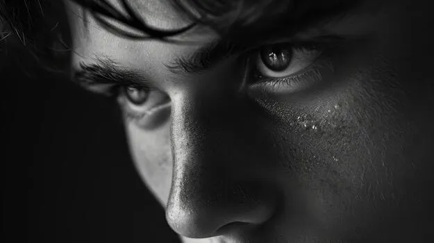
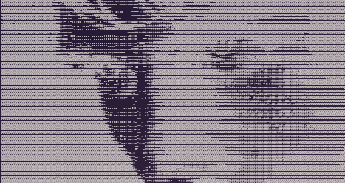
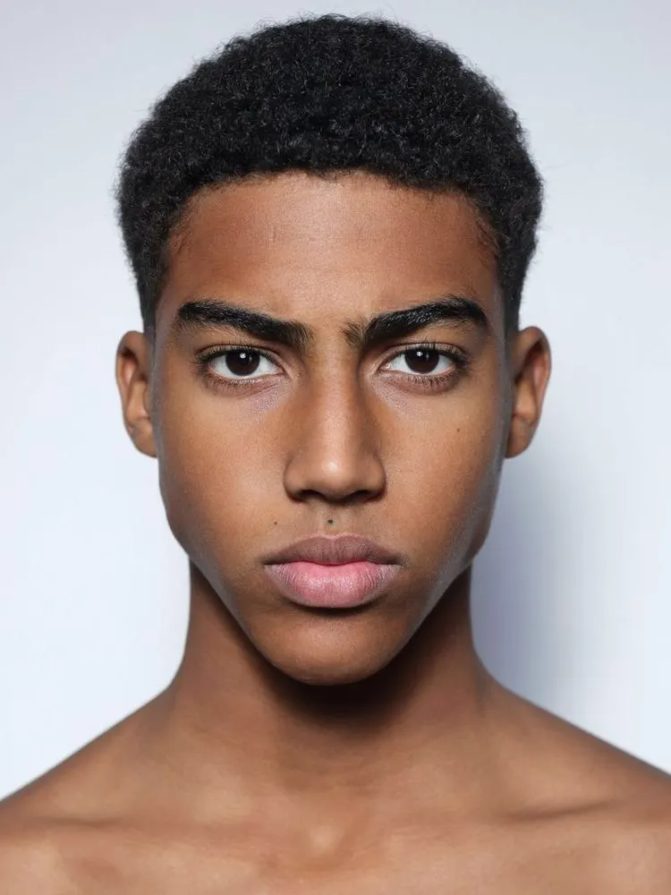
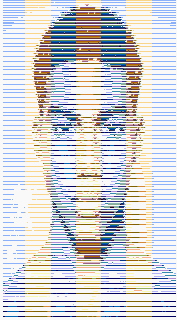

# image_to_ascii

This project turns a photo into text art. It looks at how light or dark each part of the picture is, and replaces that spot with a character. Dark areas get a "heavy" character like @ or #. Light areas get a "light" character like . or a blank space. Put them all together and you get a picture made entirely out of text.

There are two ways to use it:
- A website, just open it in your browser, no install needed
- A Python script you run from the command line

## Live demo

[https://ziyadshaikh-cook.github.io/image_to_ascii/](https://ziyadshaikh-cook.github.io/image_to_ascii/)

## Example

Original photo:



Turned into ASCII art:



## Example 2

Original photo:



Turned into ASCII art:




## How to use the website

Go to the live demo link above. Drop in a photo, or click to pick one from your computer. There's a slider to control how much detail is shown, and a button to flip light and dark if the result looks backwards. You can copy the result or download it as a text file. Everything happens in your browser, the photo is never sent anywhere.

## How to use the script

You need Python installed, along with two small libraries (Pillow and numpy).

```
pip install -r requirements.txt
python main.py your_photo.jpg
```

A few extra options:
- `-w 150` makes the output wider, more detail
- `-o result.txt` saves the output to a file instead of just printing it
- `--invert` flips light and dark, use this if the result looks like a negative

Example:
```
python main.py photo.jpg -w 150 -o result.txt
```

## How it works, in plain terms

1. Shrink the photo down so there's roughly one character for each small block of the image
2. Turn it black and white
3. Balance out the lighting a bit, so a naturally dark photo doesn't just turn into a solid block of the darkest character
4. Replace each block with a character, dark blocks get a heavy character, light blocks get a light one or a blank space
The website and the script do the same four steps, one in the browser, one in Python.